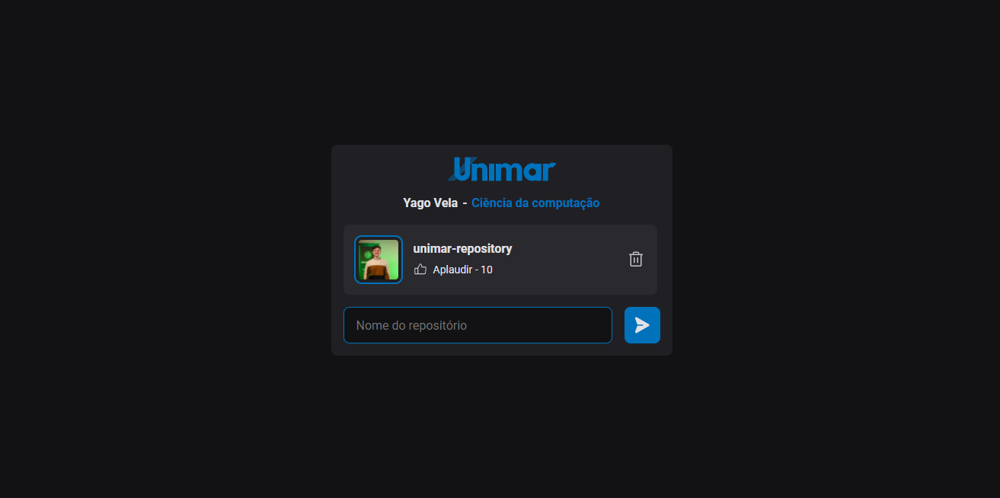

<p align="center">
   
</p>

<p align="center">
   <a href="https://www.linkedin.com/in/yagovela/">
      
   </a>
</p>

> <b>Unimar Repository</b> was a project developed to help explain some basic concepts of React during the short course held at the <b>Unimar Tech Summit 2023</b> event.


### Photos

<div align="center">
   
</div>

# :computer: Technologies

This project was made using the following technologies:

- [React](https://reactjs.org/)
- [Javascript]()
- [Phosphor Icons](https://phosphoricons.com/)

# :construction_worker: Running

```bash
# Clone the Repository
$ git@github.com:yagovelaa/unimar-repository.git
```

```bash
# Access the project folder
$ cd unimar-repository
```

```bash
# Download dependencies
$ pnpm i
```

```bash
# Execute
$ pnpm dev
```

Go to <http://localhost:5173> to see the result.
